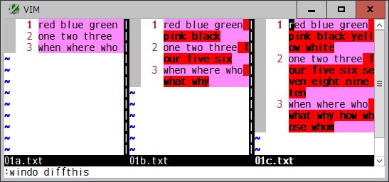
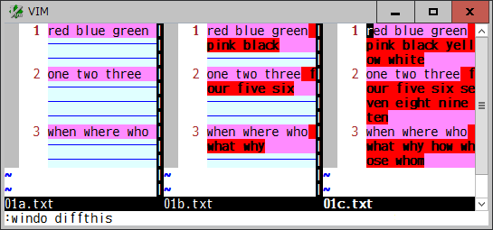
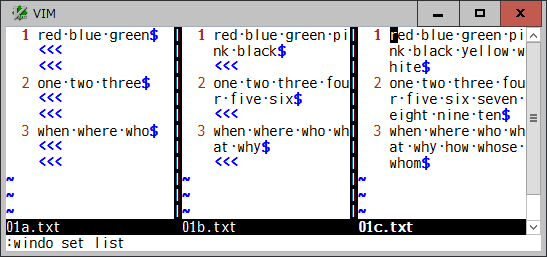

# wrapfiller

## Align each line exactly between windows even if wrapped

This plugin fills with virtual lines to exactly align the position of each
line between windows, even when the `wrap` option is on, and makes it easier
to find the lines you want to compare.

Vim's diff mode is useful to see differences between windows. All the text
lines are aligned properly by `filler` in the `diffopt` option, vertical
splits, the `scrollbind` option, and so on. But when `wrap` is on, if
`followwrap` is present in `diffopt` or it is manually set, some line will
occupy more than one screen line and each line will get misaligned. In
particular, such as on resolving git merge conflict within vim, the more diff
mode windows, the more confused. It may not be so easy to find corresponding
lines between windows.

This plugin is called each time the `diff` option is set or reset on a window.
It counts the number of screen lines required to align the position of each
line between all the diff mode windows in a tab page, and then fill them with
virtual lines on each window. As for those virtual lines, the "virtual text",
which has been implemented in some of vim post-9.0 patches and nvim 0.6.0,
is used to draw `<<<` in `hl-NonText` highlight "below" the actual lines.
Accordingly, each corresponding line will be aligned side-by-side on the same
screen position.

You can also use the `list` option for a normal non-diff mode window. This
plugin is called to find all the list mode windows, show the required virtual
lines, and align each line between windows.

When screen contents has changed by resizing window or changing some options
such as `number`, `linebreak`, and `listchars`, you can set the `diff` or
`list` option again on any window to redraw the virtual lines.

### Options

* `g:WrapFiller`, `t:WrapFiller`

  | Value | Description |
  | --- | --- |
  | 1 | enable (default) |
  | 0 | disable |
